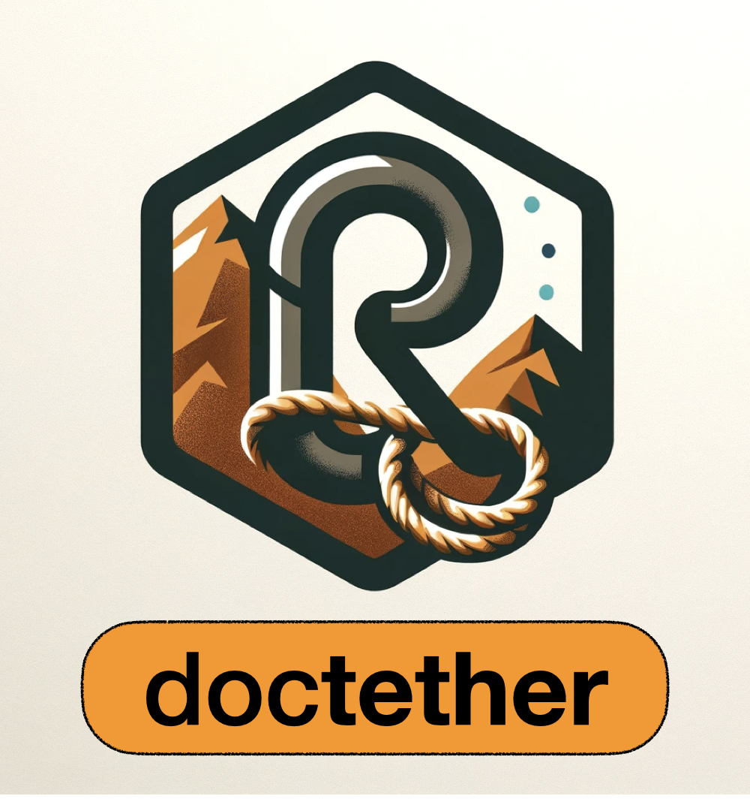

# doctether <a href="https://github.com/t-kalinowski/doctether/"></a>

<!-- badges: start -->
<!-- badges: end -->

_doctether_ makes it easy to keep R documentation up-to-date
with any upstream sources the documentation is adapted from.
It is a tool for R package maintainers.

## Installation

You can install the development version of doctether like so:

``` r
remotes::install_github("t-kalinowski/doctether")
```

## Example

{doctether} works with both roxygen blocks and rmarkdown vignettes.

### Tether roxygen blocks

Start by adding a `@tether` tag to a roxygen block. This tag will be used to
resolve the upstream documentation you want to keep the roxygen block
synchronized with.

For example, say you have in an R package a documented function,
`layer_identity()`, and you would like to keep the function and documentation
synchronized with upstream, the Python module endpoint `keras.layers.Identity`. 
You can add to the roxygen block a `@tether keras.layers.Identity` tag like this: 

``` r
#' Identity Layer
#'
#' Use as a placeholder layer when no operation is to be
#' performed.
#'
#' @param object
#' Object to compose the layer with. A tensor, array, or sequential model.
#'
#' @param ...
#' Standard layer args
#'
#' @export
#' @tether keras.layers.Identity
layer_identity <-
function (object, ...)
{
  create_layer(keras$layers$Identity, object, list(...))
}
```

In the standard `devtools::document()` (Ctrl/Cmd + Shift + D) workflow, the `@tether` tag is ignored.

To synchronize docs with tethers, call `doctether::retether()`, like so:

```r
py_run_string("import keras") # setup python __main__ w/ the latest module version

resolve_roxy_tether <- function(endpoint) {
  py_obj <- py_eval(endpoint) # e.g., keras.layers.Identity

  roxy <- py_obj$`__doc__` |> glue::trim() |> strsplit("\n") |> _[[1]]

  fn <- function() {}
  formals(fn) <- formals(py_obj)  # just the signature

  paste0(collapse = "\n",
    paste0("#' ", roxy),
    deparse(fn)
  )
}

doctether::retether(roxy_tag_eval = resolve_roxy_tether)
```

Now, when the Python endpoint `__doc__` or `__signature__` changes upstream, you
will see the changes dynamically incorporated into the roxygen block and
function definition in `R/layers.R`, as well as an updated tether file cached in
`man-src/tether/layer_identity.R`. If there are any conflicts encountered while
attempting to rebase the previous roxygen adaption and overlay it on the updated
tether, git-formatted conflict markers are inserted in the roxygen block. All
that's left then to do is to review the changes, resolve any conflicts, and
stage and commit the updates.

### Tether rmarkdown vignettes

Start by adding a `tether: ` field to the front matter of the vignette, like
this:

```rmd
---
title: Writing your own callbacks
output: rmarkdown::html_vignette
tether: https://raw.githubusercontent.com/keras-team/keras/master/guides/writing_your_own_callbacks.py
---

## Introduction

A callback is a powerful tool to customize the behavior of a Keras model during
training, evaluation, or inference. 

In this guide, you will learn what a Keras callback is, what it can do, and how you can
build your own. 

...

```

Then, `doctether::retether()` will also update vignettes. Any `Rmd`, `qmd` or
`md` files in the `vignettes/` or `vignettes-src/` directories with a `tether`
field in the yaml frontmatter are updated. By default, the value of the `tether: ` 
field is passed to `readLines()` in order to fetch the tether. You can
customize the behavior by passing a function to `rmd_field_eval`, like so:

```r
resolve_rmd_tether <- function(frontmatter_field_val) {
  sub("https://raw.githubusercontent.com/keras-team/keras/master/", 
      "~/github/keras-team/keras/", 
      frontmatter_field_val, 
      fixed = TRUE) |> 
    readLines() |>
    my_custom_post_process()
}

doctether::retether(
  roxy_tag_eval = resolve_roxy_tether, 
  rmd_field_eval = resolve_rmd_tether
)
```
